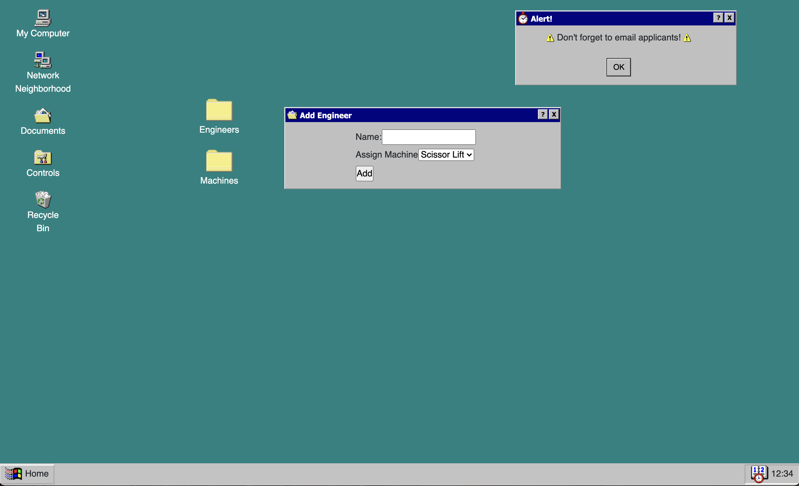

# Dr. Sillystringz's Factory

#### By Hayley McVay



## Description

Web App for Dr. Sillystringz's Factory to keep track of their business's engineers and machines. The app allows the user to add Engineers and Machines to their database, independent from each other, as well as make connections between which Engineers are licensed to which machines, and visa-versa. 
<br>

This project is styled to look like a Windows 95 desktop and the user can navigate to different views by clicking through folders on the desktop.
<br>

This project creates and implements a backend database with full CRUD capabilities that users can access and interact with on the front-end.

<br>

## Technologies Used

* C#
* .NET 5.0
* Microsoft EntityFrameworkCore
* ASP.NET MVC
* MySQL Workbench

<br>

## Setup/Installation Requirements
<br>

### NECESSARY INSTALLATIONS

* [.NET SDK](https://dotnet.microsoft.com/en-us/download/dotnet/thank-you/sdk-5.0.401-macos-x64-installer)
* [MySQL Workbench](https://dev.mysql.com/downloads/workbench/)

### SETUP STEPS

1. Clone [this](https://github.com/hmcvay/Factory.Solution) repository to your desktop
2. Navigate to the project's root directory and create `appsettings.json` file with the following code: 

```
{
  "ConnectionStrings": {
      "DefaultConnection": "Server=localhost;Port=3306;database=hayley_mcvay;uid=root;pwd={YOURPASSWORDHERE};"
  }
}
```

3. replace `{YOURPASSWORDHERE}` with the password you used when setting up MySQLWorkbench

### COMMANDS

1. Navigate to the production directory, `Factory`: 
  * Run `dotnet restore` to restore all dependencies
  * Run `dotnet build`
  * Run `dotnet run` to run the program
  * You can now copy and paste the localhost link to your browser to view application

<br>

## Known Bugs

* None so far.

<br>

## License

[ISC](https://opensource.org/licenses/ISC)

<br>

## Contact

_Copyright (c) 2022 Hayley McVay_

